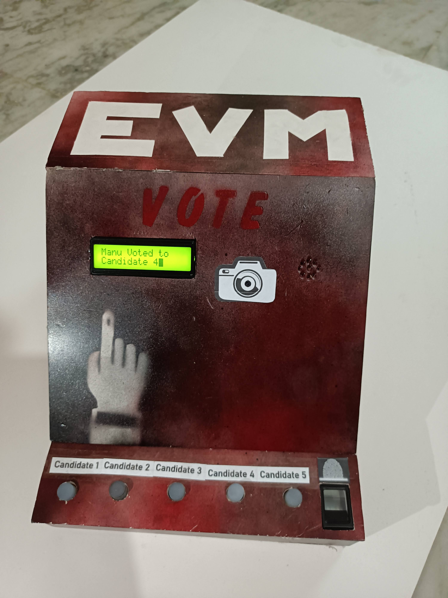
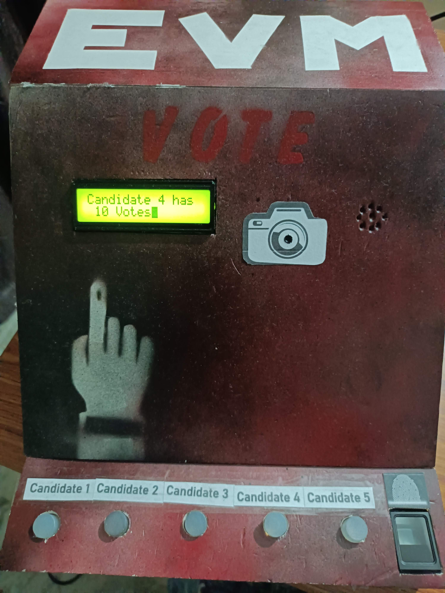
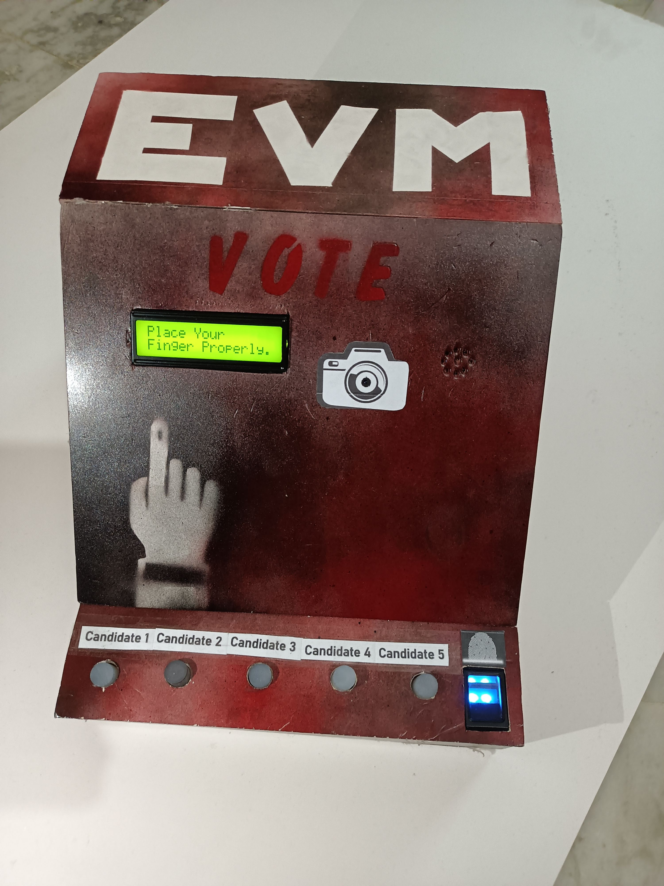
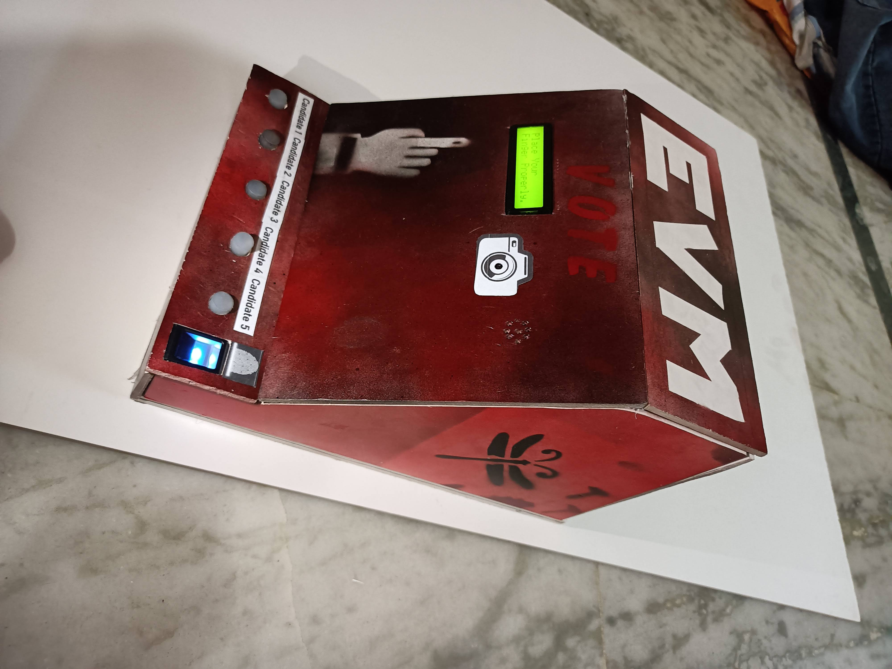

# 🗳️ Electronic Voting Machine (EVM) 🖥️

This project implements an Electronic Voting Machine (EVM) using Raspberry Pi 🍓, integrating biometric and facial recognition technology to authenticate voters before allowing them to cast their votes securely and conveniently. By combining these advanced authentication methods with the affordability and accessibility of Raspberry Pi, the project aims to enhance the integrity, efficiency, and inclusivity of the electoral process.

## Overview 🌟

The Electronic Voting Machine (EVM) developed in this project offers the following features:

- **Biometric Authentication**: Utilizes biometric data, such as fingerprints or palm prints 🖐️, to verify the identity of voters securely.

- **Facial Recognition**: Employs facial recognition technology 👤 to authenticate voters based on facial features, enhancing the accuracy and reliability of the authentication process.

- **Raspberry Pi Integration**: Leveraging the Raspberry Pi platform 🍇, the EVM provides a cost-effective and accessible solution for electronic voting, making it suitable for deployment in various electoral settings.

## How it Works 🛠️

1. **Voter Authentication**: Voters are required to undergo biometric or facial recognition authentication before gaining access to the voting interface.

2. **Ballot Casting**: Authenticated voters can then cast their votes electronically through the user-friendly interface provided by the EVM.

3. **Vote Tabulation**: The EVM tabulates the votes securely and generates accurate results, contributing to the integrity of the electoral process.

## Images 📸

*Image caption: Illustration of the Electronic Voting Machine (EVM) interface.*

*Image caption: Illustration of the Electronic Voting Machine (EVM) interface.*

*Image caption: Biometric and facial recognition authentication process.*

*Image caption: Side View of the machine.*

## Getting Started 🚀

To set up and deploy the Electronic Voting Machine (EVM) project, follow these steps:

1. Obtain the necessary hardware components, including Raspberry Pi and compatible biometric/facial recognition sensors.

2. Clone this repository to your Raspberry Pi or development machine.

3. Install the required dependencies and libraries specified in the project documentation.

4. Configure the biometric and facial recognition modules according to the setup instructions provided.

5. Run the EVM software and follow the on-screen instructions for voter authentication and ballot casting.

6. Monitor and analyze the voting process, ensuring the security and integrity of the electoral system.

## Contributions 🤝

Contributions to enhance and expand the functionality of the Electronic Voting Machine (EVM) project are welcome! Feel free to submit pull requests with new features, improvements, or bug fixes.

## Acknowledgments 🙏

- The development of this project was inspired by the need for innovative solutions to improve the electoral process and promote democratic participation.

Secure, efficient, and inclusive voting with the Electronic Voting Machine (EVM)! 🗳️
